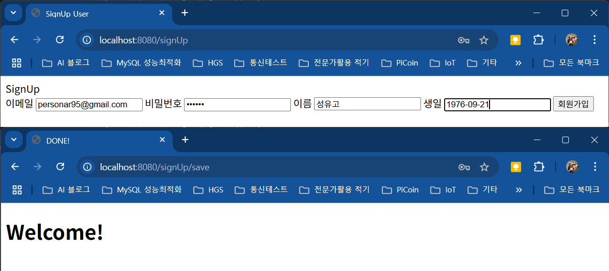
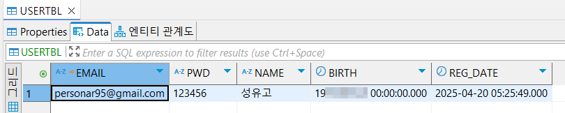

# hungout-with-springboot
스프링부트 - Spring Initializr

## Spring Boot 시작하기
- VS Code Plugin
    - Extension Pack for Java
    - Debugger for Java
    - Gradle for Java
    - Maven for Java
    - Lombok Annotations Support for VS Code
    - Project Manager for Java
    - Spring Boot Extension Pack
    - Spring Boot Tools
    - Test Runner for Java 
    - etc...

- Visual Studio Code
    - Ctrl + Shift + P - Spring Initializr: Create a Gradle Project... 선택
    - Specify Spring Boot version - 3.1.2 선택
    - Specify project language - Java
    - Input Group Id - com.hugo83
    - Input Artifact Id - sb-start
    - Specify packaging type - Jar
    - Specify Java version - 17
    - Choose dependencies
        - Spring Boot DevTools
        - Lombok
        - Spring Web
        - Thymeleaf
        - Spring Data JPA
        - MySQL Driver
    - Add to Workspace

### Spring Boot Dashboard 에서 시작
- Apps 아래
    - sb-start Run - 실패
        - Spring Data JPA에 해당하는 DB 설정부재
    - application.yml (또는 .properties) 설정

```tex
spring:
    datasource:
        driver-class-name: com.mysql.cj.jdbc.Driver
        url: jdbc:mysql://localhost:3306/springboot-new?useSSL=false&serverTimezone=Asia/Seoul&characterEncoding=UTF-8
        username: root
        password: password

    jpa:
        open-in-view: true
        hibernate:
            ddl-auto: validate # create, validate
        naming:
            physical-strategy: org.hibernate.boot.model.naming.PhysicalNamingStrategyStandardImpl
        use-new-id-generator-mappings: false
        show-sql: true
        properties:
            hibernate.format_sql: true
            dialect: org.hibernate.dialect.MySQL8InnoDBDialect

logging:
    level:
        org.hibernate.SQL: debug
```

- Apps 아래
    - sb-start Run... 성공함
    - Lombok 테스트 - build.gradle 추가
```tex
	// Lombok을 테스트 환경에도 사용
	testCompileOnly 'org.projectlombok:lombok'
	testAnnotationProcessor 'org.projectlombok:lombok'
}
```

- 추가 설정
    - 로그레벨 설정 - build.gradle 변경(확인요)

```tex
logging:
    level:
        org:
            hibernate:
                SQL: debug
            springframework: info
        com:
            hugo83: debug
        
```

- 의존성 주입 테스트
    - DataSourceTests 생성

```java
@SpringBootTest
@Log4j2
public class DataSourceTests {
    @Autowired
    private DataSource dataSource;

    @Test
    public void testConnection() throws SQLException {
        @Cleanup
        Connection conn = dataSource.getConnection();
        log.info(conn);

        Assertions.assertNotNull(conn);
    } 
}
```

- 의존성 주입 테스트 
    - 실행결과


### 웹 개발 Thymeleaf

- Controller 생성
    - SampleController 클래스

```java
@Controller
@Log4j2
public class SampleController {
    @GetMapping(value="/hello")
    public void hello(Model model) {
        log.info("hello >>>>>>>>>>>>>>>>>>>> ");
        model.addAttribute("msg", "Hello, SpringBoot!");
    }    
}
```

- View 생성
    - hello.html 
```html
<!DOCTYPE html>
<html xmlns:th="http://www.thymeleaf.org">
<head>
    <meta charset='utf-8'>
    <meta http-equiv='X-UA-Compatible' content='IE=edge'>
    <title>SpringBoot Hello</title>
</head>
<body>
    <h1 th:text="${msg}"></h1>
</body>
</html>
```

- 실행결과


- JSON 데이터 샘플
    - JsonSanmpleController

```java
@RestController
@Log4j2
public class JsonSampleController {
    @GetMapping("/helloJson")
    public String helloJson() {
        log.info("▶▷▶▷▶▷ hello :: ");
        return "{ " +
            " \"CityName\": \"Busan\", " +
            " \"homeTown\": \"Metro City\", " +
            " \"formed\": 2023, " +
            " \"members\": [ " +
            " { " +
            "    \"name\": \"Molecule Man\",  " +
            "    \"age\": 29, " +
            "    \"secretIdentity\": \"Dan Jukes\", " +
            "    \"powers\": [\"Radiation resistance\", \"Turning tiny\", \"Radiation blast\" ] " +
            "  } " +
            "] " +
        "} ";
    }
}
```

- 실행결과


[뒤로](https://github.com/hugoMGSung/hungout-with-springboot/tree/main)


### Spring Boot DB, mybatis 회원가입

1. 프로젝트 생성
    - Spring Boot version : 3.4.4
    - project language : Java
    - Input Group Id : com.hugo83
    - Input Artificial Id : mybatlog
    - packaging type : War
    - Java version : 21(설치된 자바버전과 일치)
    - Choose dependencies
        - Spring Web
        - Spring Boot DevTools
        - Thymeleaf
        - Spring Session
        - JDBC API
        - MyBatis Framework


2. 진행과정
    - DB(Oracle) 설정 및 Mybatis 환경설정
    - UserMapper.java(Interface) 설정
    - UserMapper.xml 작성
    - UserDTO.java 생성
    - UserDao.java 및 UserDaoImpl.java 생성
    - SignUpController.java 작성
    - signUpForm.html 작성

3. DB 및 Mybatis 설정
    - build.gradle에 oracle 11 버전 설치
        - implementation 'com.oracle.database.jdbc:ojdbc11:21.9.0.0'
    - application.properties 오픈 작성

        ```groovy
        spring.application.name=mybatlog
        spring.output.ansi.enabled=always

        # DB
        spring.datasource.driver-class-name=oracle.jdbc.OracleDriver
        spring.datasource.url=jdbc:oracle:thin:@localhost:1521:xe
        spring.datasource.username=bookuser
        spring.datasource.password=12345

        # mybatis
        mybatis.mapper-locations=mybatis/mapper/*.xml
        ```

4. UserMapper.java 인터페이스 생성
    - mapper 패키지 생성 후
    - UserMapper 인터페이스 생성

5. Oracle DB 생성
    ```sql
    CREATE TABLE BOOKUSER.USERTBL (
        EMAIL VARCHAR2(120) NOT NULL,
        PWD VARCHAR2(255) NOT NULL,
        NAME VARCHAR2(50) NULL,
        BIRTH DATE NULL,
        REG_DATE DATE NULL,
        CONSTRAINT USERTBL_PK PRIMARY KEY (EMAIL)
    );
    ```

    - SPRING_SESSION 테이블 생성
    ```sql
    CREATE TABLE SPRING_SESSION (
        PRIMARY_ID CHAR(36) NOT NULL,
        SESSION_ID CHAR(36) NOT NULL,
        CREATION_TIME NUMBER NOT NULL,
        LAST_ACCESS_TIME NUMBER NOT NULL,
        MAX_INACTIVE_INTERVAL INT NOT NULL,
        EXPIRY_TIME NUMBER NOT NULL,
        PRINCIPAL_NAME VARCHAR2(100),
        CONSTRAINT SPRING_SESSION_PK PRIMARY KEY (PRIMARY_ID)
    );

    CREATE UNIQUE INDEX SPRING_SESSION_IX1 ON SPRING_SESSION (SESSION_ID);

    CREATE INDEX SPRING_SESSION_IX2 ON SPRING_SESSION (EXPIRY_TIME);

    CREATE INDEX SPRING_SESSION_IX3 ON SPRING_SESSION (PRINCIPAL_NAME);


    CREATE TABLE SPRING_SESSION_ATTRIBUTES (
        SESSION_PRIMARY_ID CHAR(36) NOT NULL,
        ATTRIBUTE_NAME VARCHAR2(200) NOT NULL,
        ATTRIBUTE_BYTES BLOB  NOT NULL,
        CONSTRAINT SPRING_SESSION_ATTRIBUTES_PK PRIMARY KEY (SESSION_PRIMARY_ID, ATTRIBUTE_NAME),
        CONSTRAINT SPRING_SESSION_ATTRIBUTES_FK FOREIGN KEY (SESSION_PRIMARY_ID) REFERENCES SPRING_SESSION(PRIMARY_ID) ON DELETE CASCADE
    );
    ```

6. resources 아래 mybatis/mapper 패키지 생성
    - UserMapper.xml 생성

7. UserDTO.java 생성
    - dto 패키지 생성
    - UserDto 클래스 생성

8. UserDao.java 및 UserDaoImpl.java 작성
    - dao 패키지 생성
    - UserDao 인터페이스 생성
    - UserDaoImpl 클래스 생성

9. SignUpController.java 작성
    - controller 패키지 생성

11. html 작성
    - signUpForm.html 작성
    - home.html 작성

11. 결과화면

    

    