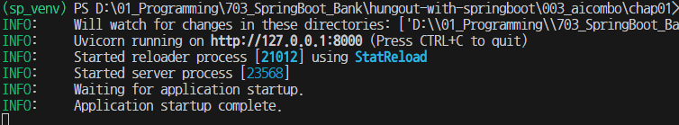
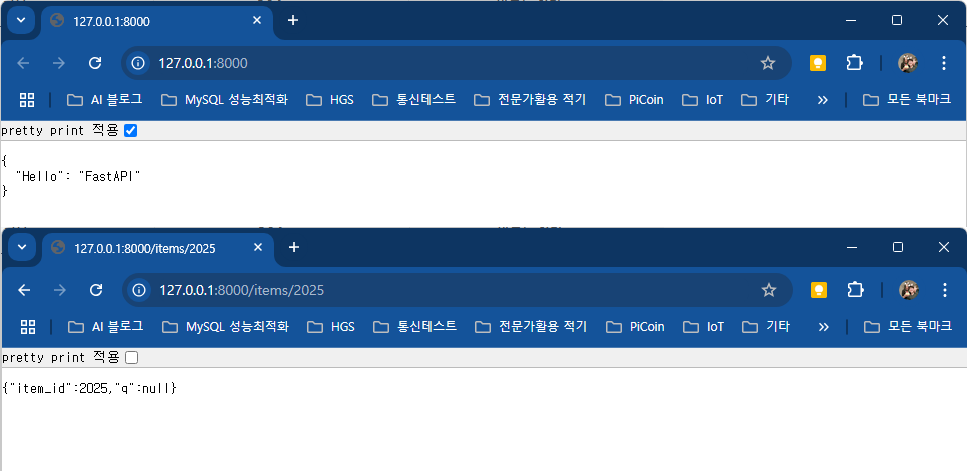
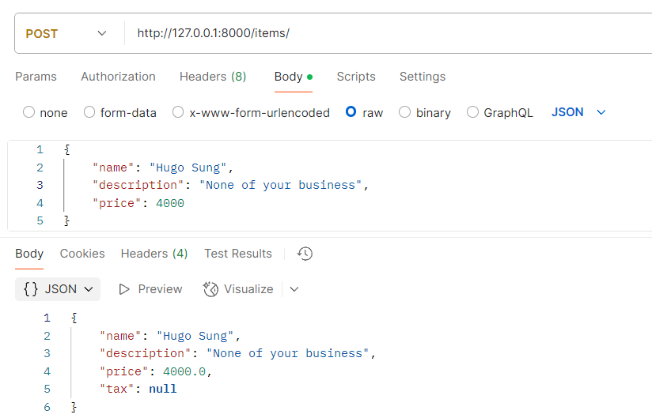

## 스프링부트와 파이썬AI 연동

자바 스프링부트 프로젝트와 파이썬 AI 프로젝트 연결하기(부크크/허진경) 참조

### FastAPI
- Python으로 작성된 웹 프레임워크

#### 설치
- 설치 명령어

    ```shell
    > pip install fastapi uvicorn
    ```

##### ASGI
- Asynchronous Server Gateway Interface

#### 첫번째 심플테스트
- main.py 작성 후
- 콘솔에서 아래와 같이 명령어 입력

    ```shell
    > uvicorn main:app --reload
    ```

    

- 실행결과

    

#### 두번째 데이터모델링
- index.py 작성
- 데이터 모델링 테스트
- Pydantic 모듈
    - 데이터 모델링을 쉽게 처리해주는 라이브러리

- 작성 후 아래와 같이 실행

    ```shell
    > uvicorn index:app --reload
    ```

- POSTMan에서 테스트 결과

    

#### 세번째 문서화
- FastAPI는 자동으로  API 문서를 생성함
